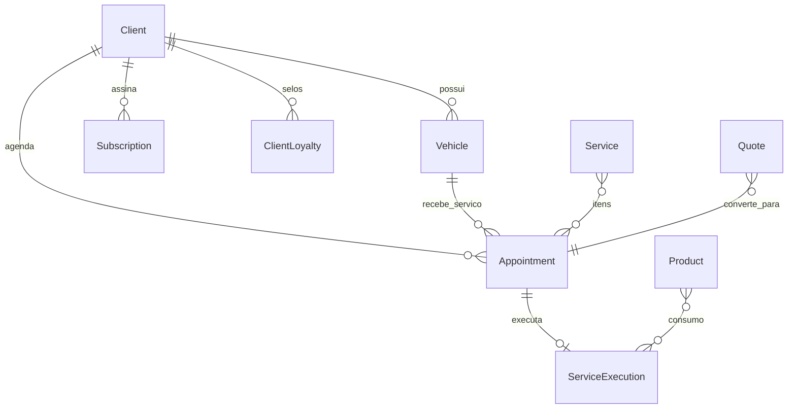

# Banco de dados local — DS Estética Auto (PWA offline)

Documento de referência para armazenamento **sem servidor** (Android, iPhone, desktop).  
Alinhado ao app em `autoglow1.1` — **estado do código em maio/2026**.

> **Escopo deste arquivo:** planejamento e modelo de dados.  
> **Não** descreve alterações já feitas no código além do que está indicado em *Situação atual*.

---

## Resumo executivo

| Decisão | Recomendação |
|---------|----------------|
| Banco local | **IndexedDB** no navegador |
| ORM / facilitador | **Dexie.js** (planejado; hoje camada manual) |
| Exportação | **SheetJS (xlsx)** — planilha + JSON completo |
| App shell | **PWA** (Vite + React) |
| Histórico do cliente | **Não** é tabela separada — consulta sobre agendamentos |
| Orçamentos | **Entidade futura** `Quote` (ainda não existe no app) |
| “Todo movimento” | Persistir **estado** nas entidades; log de auditoria **opcional** |

---

## Stack

### Ideal (produto final)

```txt
React + Vite
PWA (vite-plugin-pwa)
IndexedDB
Dexie.js
SheetJS (xlsx)
Tailwind
```

### Situação atual no `autoglow1.1`

| Peça | Status |
|------|--------|
| PWA offline | Implementado |
| IndexedDB | Implementado (`src/lib/storage/idb.js`, DB `ds-estetica-data`) |
| Coleções por entidade | Implementado (`entityStore` + chaves `collection:*.json`) |
| SheetJS / Excel | Implementado (`excelSync.js`, download em Configurações) |
| Dexie.js | **Não** — migração futura recomendada |
| Seleção de pasta (File System API) | **Removido** — dados só no navegador |
| Export JSON completo | **Planejado** (hoje: Excel + import JSON de serviços) |
| Backup automático | **Planejado** |
| `ActivityLog` (auditoria) | **Planejado** (opcional) |
| Firebase / nuvem | **Futuro** (opcional) |

---

## Visão de negócio × entidades técnicas

Lista simplificada (conversa com cliente) vs o que o app **realmente** persiste:

| Visão de negócio | Entidade no app | Arquivo lógico (IndexedDB) |
|------------------|-----------------|----------------------------|
| Clientes | `Client` | `clients.json` |
| Veículos | `Vehicle` | `vehicles.json` |
| Produtos | `Product` | `products.json` |
| Serviços (catálogo) | `Service` | `services.json` |
| Agendamentos | `Appointment` | `appointments.json` |
| Execução no box | `ServiceExecution` | `service_executions.json` |
| Histórico | — | *derivado* de `Appointment` + `ServiceExecution` |
| Financeiro / vendas | — | *derivado* de `Appointment` (concluído + pagamento) |
| Orçamentos | `Quote` *(futuro)* | — |
| Configurações do negócio | `BusinessConfig` | `business_config.json` |
| Promoções — planos | `Subscription` | `subscriptions.json` |
| Promoções — selos | `ClientLoyalty` | `client_loyalty.json` |
| Promoções — regras | `LoyaltyConfig` | `loyalty_config.json` |

**Planilha Excel** (`ds-estetica-dados.xlsx`), abas atuais:

- Clientes → `Client`
- Produtos → `Product`
- Servicos → `Service`
- Agendamentos → `Appointment`
- Financeiros → linhas derivadas de agendamentos concluídos / com pagamento

---

## O que salvar (regra geral)

### 1. Estado de negócio (obrigatório)

Tudo que o usuário cria, edita ou exclui nas telas deve ser gravado nas entidades acima.  
Cada `create`, `update` e `delete` já conta como “movimento” persistido.

Campos comuns em todos os registros (padrão do app):

```txt
id              UUID
created_date    ISO 8601
updated_date    ISO 8601
```

### 2. Histórico (não duplicar)

O **histórico do cliente** é uma **consulta**, não uma tabela extra:

- Filtrar `Appointment` por `client_id` (ordenar por `date` desc).
- Complementar com `ServiceExecution` ligado ao agendamento (`appointment_id`).

Evitar copiar os mesmos dados para uma coleção `Historico` — gera inconsistência.

### 3. Trilha de auditoria (opcional — fase 2)

Se for necessário “registrar todo movimento” além do estado final:

```txt
ActivityLog
  id
  timestamp
  entity          ex: Client, Appointment
  entity_id
  action          create | update | delete | status_change
  payload_before  JSON (opcional)
  payload_after   JSON (opcional)
  screen          rota ou tela (opcional)
```

Útil para: desfazer, debug, conformidade.  
**Não** substitui as entidades principais.

### 4. Orçamentos (fase futura)

Hoje o app **não** tem entidade `Quote` / Orçamento.  
Fluxo sugerido quando implementar:

```txt
Quote (rascunho)
  → status: rascunho | enviado | aprovado | recusado | convertido
  → ao aprovar: criar Appointment
```

Até lá, agendamento com `status: agendado` e `payment_status: pendente` pode funcionar como pré-venda informal.

---

## Modelo de dados (campos principais)

Schemas de referência: `base44/entities/*.jsonc` no monorepo AUTOGLOW.

### Client (`Client`)

```txt
id, name*, phone*, email, cpf, notes
created_date, updated_date
```

### Vehicle (`Vehicle`)

```txt
id, client_id*, brand*, model*, plate*, year, color
damage_photos[]   URLs (data URL ou caminho local)
created_date, updated_date
```

### Product (`Product`)

```txt
id, name*, unit (ml|L|g|kg|un|m²), stock_quantity
cost_price, category (abrasivo|quimico|protecao|microfibra|outros)
description, active
created_date, updated_date
```

### Service (`Service`)

```txt
id, name*, price*, category*
  (polimento|lavagem|higienizacao|protecao|vitrificacao|outros)
description, duration_minutes, active
created_date, updated_date
```

Catálogo inicial: `data/seed/services.json` (17 serviços).

### Appointment (`Appointment`)

```txt
id, client_id, client_name, vehicle_id, vehicle_info
service_ids[], service_names, date, time
status (agendado|em_andamento|concluido|cancelado)
total_price, notes
payment_status (pendente|pago|parcial)
payment_method (dinheiro|pix|cartao_credito|cartao_debito)
created_date, updated_date
```

Equivale à ideia de **“Vendas”** do documento antigo, com mais detalhe operacional.

### ServiceExecution (`ServiceExecution`)

```txt
id, appointment_id, client_name, vehicle_id, vehicle_info
service_names, date
status (em_andamento|concluido)
products_used[]  { product_id, product_name, quantity, unit }
total_services_price, total_products_cost, technician_notes
created_date, updated_date
```

### BusinessConfig (`BusinessConfig`)

```txt
business_name, owner_name, phone, whatsapp, address, instagram
opening_hours, pix_key, pix_key_type
reminder_days_before, whatsapp_reminder_message
```

### Subscription (`Subscription`)

```txt
client_id, client_name, client_phone, plan_name, description
value, due_day, due_date, status (ativo|vencido|cancelado)
```

### ClientLoyalty / LoyaltyConfig

Regras e selos de fidelidade — ver schemas em `base44/entities/`.

### Quote (`Quote`) — **planejado**

```txt
id, client_id, vehicle_id, items[]
  { type: service|product, ref_id, name, qty, unit_price, total }
subtotal, discount, total, valid_until
status (rascunho|enviado|aprovado|recusado|convertido)
appointment_id   preenchido ao converter
created_date, updated_date
```

---

## Relacionamentos (diagrama lógico)



---

## IndexedDB + Dexie

### Hoje

- Banco: `ds-estetica-data`, store `kv`.
- Chaves: `collection:clients.json`, `collection:services.json`, …, `manifest`, `file:ds-estetica-dados.xlsx`.
- Leitura/escrita: array JSON inteiro por coleção (adequado para volume pequeno/médio).

### Com Dexie (roadmap)

Esboço de schema para consultas indexadas:

```js
// Exemplo conceitual — não implementado ainda
const db = new Dexie('ds-estetica-data');

db.version(1).stores({
  clients: 'id, name, phone',
  vehicles: 'id, client_id, plate',
  products: 'id, name, category, active',
  services: 'id, category, active',
  appointments: 'id, client_id, date, status, payment_status',
  serviceExecutions: 'id, appointment_id, date',
  subscriptions: 'id, client_id, status',
  businessConfig: 'id',
  clientLoyalty: 'id, client_id',
  loyaltyConfig: 'id',
  activityLog: 'id, timestamp, entity, entity_id',  // opcional
  quotes: 'id, client_id, status, valid_until',    // futuro
});
```

**Quando migrar:** muitos registros, filtros frequentes, transações atômicas entre coleções, ou `ActivityLog`.

---

## Backup e riscos

### Riscos (dados só no aparelho)

- Limpar cache / dados do site no navegador.
- Trocar de navegador ou dispositivo.
- Formatar o celular.
- **iOS (Safari):** armazenamento pode ser reduzido após longo período sem uso do PWA.

### Estratégia de backup (prioridade)

| Prioridade | Ação | Status |
|------------|------|--------|
| 1 | Exportar Excel (`ds-estetica-dados.xlsx`) | Implementado (manual, Configurações) |
| 2 | Exportar **JSON completo** (todas as coleções + manifest) | Planejado |
| 3 | Importar JSON (restaurar backup) | Planejado |
| 4 | Aviso “último backup há X dias” | Planejado |
| 5 | Backup automático (ex.: diário, download ou compartilhar) | Planejado |
| 6 | Nuvem (Firebase, Drive, etc.) | Futuro opcional |

Excel sozinho **não** basta para restaurar o app com fidelidade (faltam campos, execuções, configs). JSON completo + Excel é o par ideal.

---

## Vantagens e desvantagens

### Vantagens

- Android, iPhone e desktop.
- Offline total após carregar o app.
- Sem servidor, sem mensalidade de hospedagem de API.
- Resposta rápida (dados locais).

### Desvantagens

- Sem sync entre aparelhos (salvo backup manual ou nuvem futura).
- Risco de perda se não houver backup.
- iOS exige disciplina de exportação.

---

## Alternativa futura: Firebase (ou similar)

- Sincronização entre dispositivos.
- Backup implícito na nuvem.
- Exige conta, regras de segurança e conexão ocasional.

**Sugestão de fases:**

```txt
Fase 1 (atual → curto prazo)
  PWA + IndexedDB + Excel + export/import JSON

Fase 2
  Dexie + índices + ActivityLog (opcional) + backup automático

Fase 3 (se necessário)
  Firebase / Supabase com modo offline
```

---

## O que evitar

| Abordagem | Motivo |
|-----------|--------|
| **localStorage** para cadastros | Limite ~5 MB, lento, sem estrutura |
| **Somente Excel** como banco | Lento, difícil de consultar, restore incompleto |
| **SQLite direto no PWA** | Suporte irregular no iOS |
| **Tabela “Histórico” duplicada** | Redundância com agendamentos |
| **File System API obrigatória** | Removido do fluxo; IndexedDB é mais universal no PWA |

---

## Checklist de implementação (código — não iniciado neste doc)

Use como backlog técnico; **nenhum item abaixo altera o app por si só**.

- [ ] Adicionar dependência `dexie` e camada de migração a partir do KV atual
- [ ] Export JSON completo (zip ou um `.json` com todas as coleções)
- [ ] Import JSON com confirmação e merge/replace
- [ ] Lembrete de backup na UI
- [ ] Entidade `Quote` + telas de orçamento
- [ ] `ActivityLog` (se auditoria for requisito)
- [ ] Abas Excel: Execuções, Assinaturas (opcional)
- [ ] Avaliar Firebase apenas após backup local estável

---

## Referências no repositório

| Caminho | Conteúdo |
|---------|----------|
| `src/lib/storage/constants.js` | Nomes das coleções e abas Excel |
| `src/lib/storage/fileSystem.js` | Persistência IndexedDB |
| `src/lib/storage/entityStore.js` | CRUD genérico |
| `src/lib/storage/excelSync.js` | Geração da planilha |
| `src/lib/storage/seedData.js` | Seed e import de serviços |
| `base44/entities/*.jsonc` | Schemas oficiais das entidades |

---

*Última revisão: alinhado ao `autoglow1.1` após remoção da seleção de pasta e adoção de IndexedDB como armazenamento único.*
